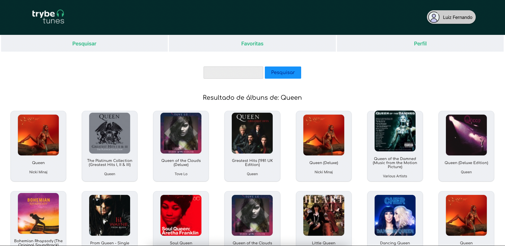
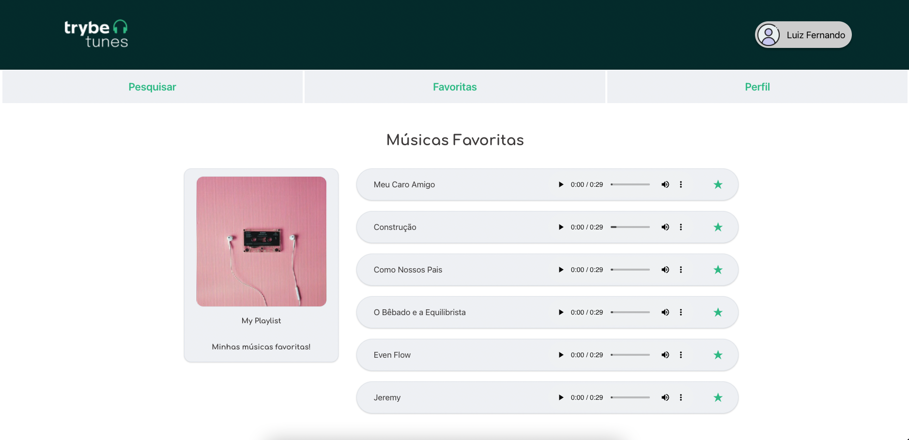
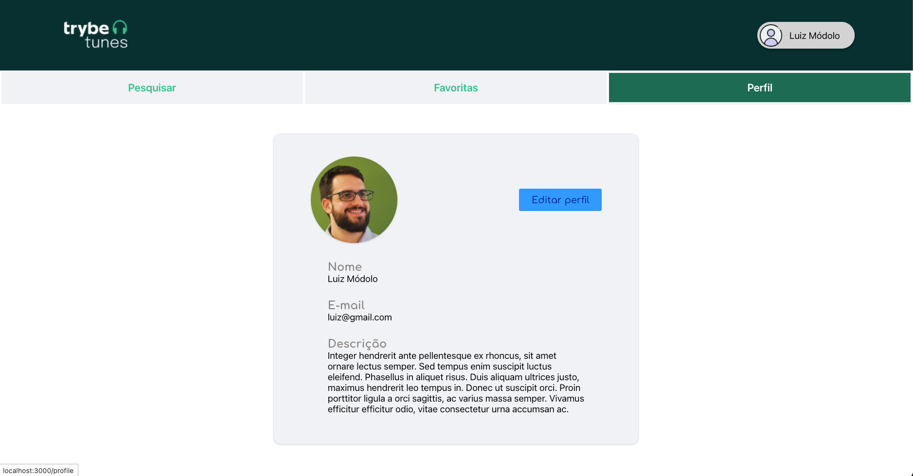

# TrybeTunes Project #

Terceiro projeto do módulo de _Front-End_ da [Trybe](https://www.betrybe.com) entregue. 
Nesse bloco estudamos mais React com os primeiros passos em `React Router` e `Single Page Aplication`.

Nesse projeto fizemos uma página de pesquisa de bandas, álbuns e músicas com a API do **iTunes**. Como funcionalidade temos uma tela de login, pesquisa pelas bandas e álbuns, além de conseguir adicionar e retirar as músicas da lista de favoritas e personalizar seu perfil.

Abaixo imagens do projeto.

*tela inicial do Login sem senha*

*tela de busca dos artistas na API do iTunes*

*tela dos resultados gerados na pesquisa*

*tela de um álbum especifico clicado. Podemos ouvir o preview das músicas*

*tela das músicas favoritas salvas ao clicar no checkbox*

*tela de perfil do usuário*

*tela de edição das informações do perfil do usuário*